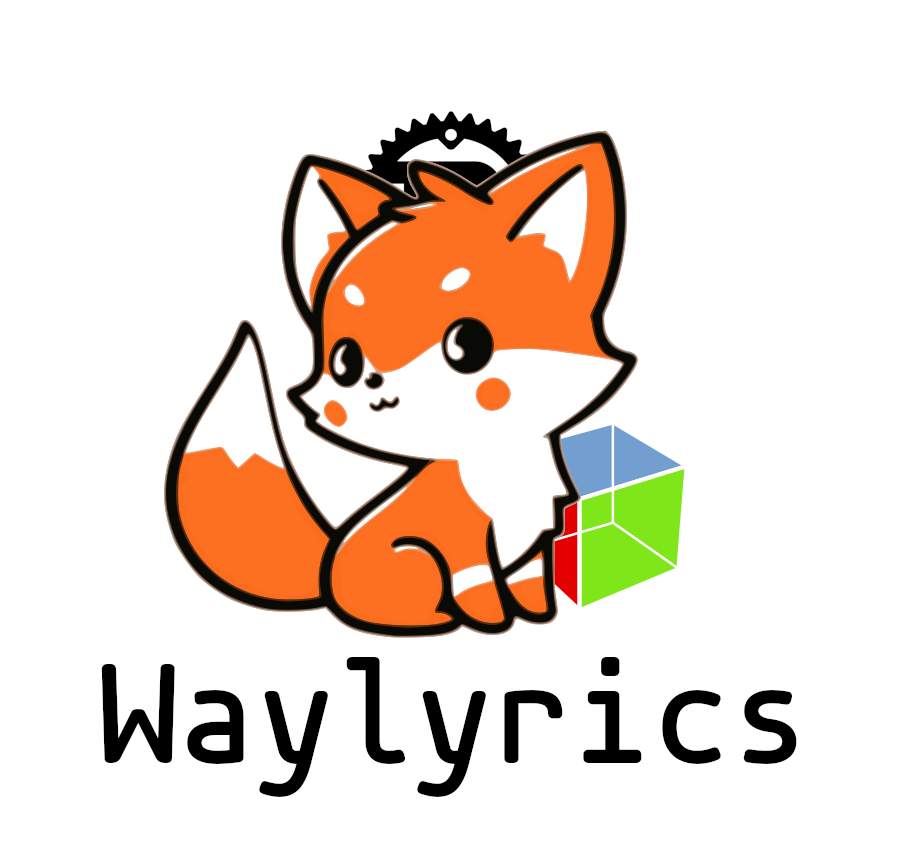

# Waylyrics

<p align="center">
  </img>
  <br />
  <a href="https://t.me/+FWgnE0GRDYZhNjc1">Telegram</a>&nbsp;|&nbsp;
  <a href="https://matrix.to/#/#waylyrics_x:catgirl.cloud">Matrix</a>
  <br />
  <a href="https://www.bilibili.com/video/BV1ap421R7nD" target="blank">Feature Preview</a>
</p>

- [Waylyrics](#waylyrics)
  - [Build/Install](#buildinstall)
  - [Usage](#usage)
  - [Requirement](#requirement)
  - [Plugins](#plugins)
  - [Recommended Players](#recommended-players)
    - [Linux](#linux)
    - [Windows](#windows)
  - [Unsupported Players](#unsupported-players)
  - [Directories](#directories)
    - [Linux/Unix](#linuxunix)
    - [Windows](#windows-1)
  - [Alternatives](#alternatives)
    - [Linux](#linux-1)
    - [Windows](#windows-2)
  - [Credit](#credit)
  - [License](#license)

## Build/Install

Check [INSTALLATION.en.md](doc/INSTALLATION.en.md)

## Usage

Also check [desktop file](metainfo/io.github.waylyrics.Waylyrics.desktop)

https://github.com/waylyrics/waylyrics/blob/d2132b42b135e0de09640de6a5a0b4797871c67e/src/config.rs#L67-L71

## Requirement

- A player at least supports MPRIS PlaybackStatus, Position and Metadata(with title)
- In particular, a wm allows you set windows as top-level

## Plugins

[waylyrics-sakura-translator]: https://github.com/WithourAI/waylyrics-sakura-translator
[SakuraLLM]: https://github.com/SakuraLLM/Sakura-13B-Galgame

| Plugin                        | Description                             | Version |
| ----------------------------- | --------------------------------------- | ------- |
| [waylyrics-sakura-translator] | ja->zh translator based on [SakuraLLM ] | v0.3.6+ |

## Recommended Players

### Linux

[extension]: https://addons.mozilla.org/en-US/firefox/addon/plasma-integration/
[netease-cloud-music-gtk]: https://github.com/gmg137/netease-cloud-music-gtk
[amberol]: https://gitlab.gnome.org/World/amberol
[lollypop]: https://github.com/hamonikr/lollypop

[FeelUOwn]: https://github.com/feeluown/FeelUOwn/
[Qcm]: https://github.com/hypengw/Qcm
[Telegram]: https://t.me/Music163Bot
[VLC]: https://www.videolan.org

[Electron-NCM]: https://github.com/Rocket1184/electron-netease-cloud-music
[YesPlayMusic]: https://github.com/qier222/YesPlayMusic
[youtube-music]: https://github.com/th-ch/youtube-music

[go-musicfox]: https://github.com/go-musicfox/go-musicfox

[mpv-mpris]: https://github.com/hoyon/mpv-mpris

[mpd-mpris]: https://github.com/natsukagami/mpd-mpris
[ncmpcpp]: https://github.com/ncmpcpp/ncmpcpp

[DeaDBeeF]: https://deadbeef.sourceforge.io/
[deadbeef-mpris2-plugin]: https://github.com/DeaDBeeF-Player/deadbeef-mpris2-plugin

| Name                      | Online? | Framework | #                                          |
| ------------------------- | ------- | --------- | ------------------------------------------ |
| Firefox                   | O       | Browser   | needs [extension]                          |
| Chrome                    | O       | Browser   |                                            |
| [DeaDBeeF]                | X       | GTK3      | [deadbeef-mpris2-plugin]                   |
| [netease-cloud-music-gtk] | O       | GTK4      | 2.3.0+                                     |
| [amberol]                 | X       | GTK4      |                                            |
| [lollypop]                | X       | GTK4      |                                            |
| [FeelUOwn]                | O       | Qt5       | 3.9.12+                                    |
| [VLC]                     | O       | Qt5       |                                            |
| [Qcm]                     | O       | Qt6       |                                            |
| [Telegram]                | O       | Qt6       |                                            |
| [Electron-NCM]            | O       | Electron  |                                            |
| [YesPlayMusic]            | O       | Electron  | R3Play appends unexpected suffixs to title |
| [youtube-music]           | O       | Electron  | enable `Shortcut`                          |
| [go-musicfox]             | O       | bubbletea | 4.3.2+                                     |
| mpv                       | O       | Native    | load [mpv-mpris]                           |
| [ncmpcpp]                 | X       | ncursew   | [mpd-mpris]                                |

### Windows

| Name          | Online? | Framework | #                                                             |
| ------------- | ------- | --------- | ------------------------------------------------------------- |
| [FeelUOwn]    | O       | Qt5       | 4.0.1+                                                        |
| [go-musicfox] | O       | bubbletea | 4.4.0+                                                        |
| Media Player  | X       | UWP       | it will **NOT** update timeline <br> immediately after a seek |

## Unsupported Players

[listen1-desktop]: https://github.com/listen1/listen1_desktop

| Player            | OSD | issue               |
| ----------------- | --- | ------------------- |
| qqmusic           | O   | position stays on 0 |
| [listen1-desktop] | O   | position stays on 0 |

## Directories

### Linux/Unix

```
~/.cache/waylyrics/XX/...
~/.config/waylyrics/...
# waylyrics will first try load theme here, if not exists, load from global template.
~/.local/share/waylyrics/_themes/...
```

### Windows

```
%AppData%\poly000\waylyrics\config
%AppData%\poly000\waylyrics\data
%LocalAppData%\poly000\waylyrics\cache
```

## Alternatives

[waybar-netease-music-lyrics]: https://github.com/kangxiaoju/waybar-netease-music-lyrics
[Sunamu]: https://github.com/NyaomiDEV/Sunamu
[lyricsSeeker]: https://github.com/BruceZhang1993/LyricsSeeker
[caraoke-plasmoid]: https://github.com/Copay/caraoke-plasmoid
[desktop-lyric]: https://github.com/tuberry/desktop-lyric
[AutoLyric]: https://www.autolyric.com/
[Lyricify]: https://github.com/WXRIW/Lyricify-App
[osdlyrics]: https://github.com/osdlyrics/osdlyrics
[desktop_lyric]: https://github.com/Moeweb647252/desktop_lyric

### Linux

| Name                          | Stack         | DE/WM         | Player Support     | #   |
| ----------------------------- | ------------- | ------------- | ------------------ | --- |
| [waybar-netease-music-lyrics] | bash          | wlroots-based | Any NCM Player[^0] |     |
| [Sunamu]                      | Electron/TS   | X/Xwayland    | MPRIS              |     |
| [desktop-lyric]               | JavaScript    | GNOME         | MPRIS              |     |
| [caraoke-plasmoid]            | QML           | Plasma        | MPRIS              |     |
| [osdlyrics]                   | GTK2/C+Python | X/Xwayland    | MPRIS              |     |
| [lyricsSeeker]                | Python+QML    | Plasma        |                    | WIP |
| [desktop_lyric]               | egui          | Plasma        | MPRIS              |     |

[^0]: https://github.com/kangxiaoju/waybar-netease-music-lyrics/blob/f84810fe1628ca38fa36d88506152d88cf0e77e4/song.sh#L41-L59

### Windows

| Name        | Stack                | Player Support                                                                                      | #   |
| ----------- | -------------------- | --------------------------------------------------------------------------------------------------- | --- |
| [AutoLyric] | C++                  | Windows Media Player<br>Foobar2000<br>AIMP<br>Winamp                                                |     |
| [Lyricify]  | UWP/C#(4+)<br>C#(3-) | Spotify<br>iTunes<br>Apple Music<br>Music Center<br>QQ Music<br>Netease Cloud Music<br>YesPlayMusic |     |

## Credit

[gtk4-rs]: https://github.com/gtk-rs/gtk4-rs

- [gtk4-rs], Rust bind to GTK-4.


## License

[The MIT License (MIT)](https://raw.githubusercontent.com/waylyrics/waylyrics/master/LICENSE)

This project icon is licensed under a [Creative Commons Attribution 4.0 International License](https://creativecommons.org/licenses/by/4.0/).
