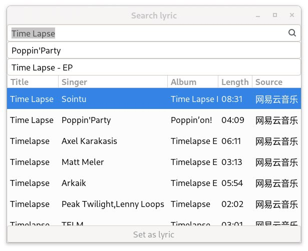

# Waylyrics

<div align="center">
  </img>
  <br />
  <div>
    <a href="https://t.me/+FWgnE0GRDYZhNjc1"></a>
    <a href="https://matrix.to/#/#waylyrics_x:catgirl.cloud"></a>
    <br />
    <a href="https://www.bilibili.com/video/av1555055010/" target="blank"></a>
  </div>
</div>

[简体中文](./README.md) | [English](./README.en.md)

- [介绍](#介绍)
- [界面预览](#界面预览)
- [构建/安装](#构建安装)
- [用法](#用法)
- [依赖](#依赖)
- [插件](#插件)
- [推荐的播放器](#推荐的播放器)
- [无法使用的播放器](#无法使用的播放器)
- [目录](#目录)
- [替代品](#替代品)
- [Credit](#credit)
- [License](#license)

> 目前 waylyrics 暂时处于不活跃开发，两位主要开发者忙于生计，暂时只进行 PR Review / 依赖更新
>
> 遇到问题请参考 [issues](https://github.com/waylyrics/waylyrics/issues) 和 [wiki](https://github.com/waylyrics/waylyrics/wiki), [discussion](https://github.com/waylyrics/waylyrics/discussions) 等

## 介绍

Waylyrics 是一款支持 Linux/Windows 的桌面歌词软件。

关键特性：
- 基于 GTK 4
- 保持最新的依赖
- 自动切换亮暗主题
- 配置文件使用 TOML 格式
- 启动时会为配置文件添加最新注释
- CSS 自定义主题，提供[多种预设主题](themes)
- 理论上正确接入 MPRIS/SMTC 即可兼容
- 通过社区贡献，优化了一部分音乐播放器的歌词接入

## 界面预览

### 主界面

> 边框可以隐藏（ctrl-d/托盘菜单->开关边框）


### 搜索歌词



## 构建/安装

> 注意：最低需要Rust版本为 1.78.0

详阅 [INSTALLATION.md](doc/INSTALLATION.md)

Ubuntu用户详阅 [BUILD_GUIDE_UBUNTU.zh_cn.md](doc/BUILD_GUIDE_UBUNTU.zh_cn.md)

## 用法

另见 [desktop文件](metainfo/io.github.waylyrics.Waylyrics.desktop)

https://github.com/waylyrics/waylyrics/blob/d2132b42b135e0de09640de6a5a0b4797871c67e/src/config.rs#L67-L71

## 依赖

- 播放器需至少在MPRIS提供 Position，Metadata(有title)，PlaybackStatus
- 需要你的wm允许你设置窗口置顶

## 插件

[waylyrics-sakura-translator]: https://github.com/WithourAI/waylyrics-sakura-translator
[SakuraLLM]: https://github.com/SakuraLLM/Sakura-13B-Galgame

| 插件                          | 简介                            | 版本    |
| ----------------------------- | ------------------------------- | ------- |
| [waylyrics-sakura-translator] | 日译中翻译插件，基于[SakuraLLM] | v0.3.6+ |

## 推荐的播放器

### Linux

[插件]: https://addons.mozilla.org/en-US/firefox/addon/plasma-integration/
[netease-cloud-music-gtk]: https://github.com/gmg137/netease-cloud-music-gtk
[amberol]: https://gitlab.gnome.org/World/amberol
[lollypop]: https://github.com/hamonikr/lollypop

[FeelUOwn]: https://github.com/feeluown/FeelUOwn/
[Qcm]: https://github.com/hypengw/Qcm
[Telegram]: https://t.me/Music163Bot
[VLC]: https://www.videolan.org

[Electron-NCM]: https://github.com/Rocket1184/electron-netease-cloud-music
[YesPlayMusic]: https://github.com/qier222/YesPlayMusic
[youtube-music]: https://github.com/th-ch/youtube-music
[go-musicfox]: https://github.com/go-musicfox/go-musicfox

[mpv-mpris]: https://github.com/hoyon/mpv-mpris

[mpd-mpris]: https://github.com/natsukagami/mpd-mpris
[ncmpcpp]: https://github.com/ncmpcpp/ncmpcpp

[DeaDBeeF]: https://deadbeef.sourceforge.io/
[deadbeef-mpris2-plugin]: https://github.com/DeaDBeeF-Player/deadbeef-mpris2-plugin

[SPlayer]: https://github.com/imsyy/SPlayer

[listen1-desktop]: https://github.com/listen1/listen1_desktop
[listen1-pr]: https://github.com/listen1/listen1_desktop/pull/1325

| 名称                      | 在线 | 框架      | 备注                       |
| ------------------------- | ---- | --------- | -------------------------- |
| Firefox                   | O    | 浏览器    | 需要[插件]                 |
| Chrome                    | O    | 浏览器    |                            |
| [DeaDBeeF]                | X    | GTK3      | [deadbeef-mpris2-plugin]   |
| [netease-cloud-music-gtk] | O    | GTK4      | 2.3.0+                     |
| [amberol]                 | X    | GTK4      |                            |
| [lollypop]                | X    | GTK4      |                            |
| [FeelUOwn]                | O    | Qt5       | 3.9.12+                    |
| [VLC]                     | O    | Qt5       |                            |
| [Qcm]                     | O    | Qt6       |                            |
| [Telegram]                | O    | Qt6       |                            |
| [listen1-desktop]         | O    | Electron  | v2.33.0 [修复][listen2-pr] |
| [Electron-NCM]            | O    | Electron  |                            |
| [YesPlayMusic]            | O    | Electron  | R3Play会给标题加额外的后缀 |
| [youtube-music]           | O    | Electron  | 启用Shortcut               |
| [go-musicfox]             | O    | bubbletea | 4.3.2+                     |
| mpv                       | O    | 原生      | [mpv-mpris]                |
| [ncmpcpp]                 | X    | ncursew   | [mpd-mpris]                |

### Windows

| 名称          | 在线 | 框架      | 备注               |
| ------------- | ---- | --------- | ------------------ |
| [FeelUOwn]    | O    | Qt5       | 4.0.1+             |
| [SPlayer]     | O    | Electron  |                    |
| [go-musicfox] | O    | bubbletea | 4.4.0+             |
| 媒体播放器    | X    | UWP       | 拖拽后不会立即更新 |

## 无法使用的播放器

[listen1-desktop]: https://github.com/listen1/listen1_desktop

| Player  | OSD | issue       | 备注 |
| ------- | --- | ----------- | ---- |
| qqmusic | O   | 位置一直为0 |      |

## 目录

一般情况会创建的目录（可能被用户XDG设置影响）

### Linux/Unix

```
~/.cache/waylyrics/XX/...
~/.config/waylyrics/...
# waylyrics 会首先尝试在这里加载主题，找不到的话就从全局模板目录找
~/.local/share/waylyrics/_themes/...
```

### Windows

```
%AppData%\poly000\waylyrics\config
%AppData%\poly000\waylyrics\data
%LocalAppData%\poly000\waylyrics\cache
```

## 替代品

[waybar-netease-music-lyrics]: https://github.com/kangxiaoju/waybar-netease-music-lyrics
[Sunamu]: https://github.com/NyaomiDEV/Sunamu
[lyricsSeeker]: https://github.com/BruceZhang1993/LyricsSeeker
[caraoke-plasmoid]: https://github.com/Copay/caraoke-plasmoid
[desktop-lyric]: https://github.com/tuberry/desktop-lyric
[可道歌词]: https://www.autolyric.com/
[Lyricify]: https://github.com/WXRIW/Lyricify-App
[osdlyrics]: https://github.com/osdlyrics/osdlyrics
[desktop_lyric]: https://github.com/Moeweb647252/desktop_lyric
[lyrica]: https://github.com/chiyuki0325/lyrica
[lyric-for-musicfox]: https://github.com/SmileYik/lyric-for-musicfox

### Linux

| 名称                          | 技术栈        | 桌面支持      | 播放器支持 | 备注 |
| ----------------------------- | ------------- | ------------- | ---------- | ---- |
| [lyric-for-musicfox]          | Qt/C++        | *             | musicfox   |      |
| [waybar-netease-music-lyrics] | bash          | wlroots-based | NCM[^0]    |      |
| [Sunamu]                      | Electron/TS   | X/Xwayland    | MPRIS      |      |
| [desktop-lyric]               | JavaScript    | GNOME         | MPRIS      |      |
| [caraoke-plasmoid]            | QML           | Plasma        | MPRIS      |      |
| [osdlyrics]                   | GTK2/C+Python | X/Xwayland    | MPRIS      |      |
| [lyricsSeeker]                | Python+QML    | Plasma        |            | WIP  |
| [desktop_lyric]               | egui          | Plasma        | MPRIS      |      |
| [lyrica]                      | Rust+QML      | Plasma        | MPRIS      |      |

[^0]: https://github.com/kangxiaoju/waybar-netease-music-lyrics/blob/f84810fe1628ca38fa36d88506152d88cf0e77e4/song.sh#L41-L59

### Windows

| 名称             | 技术栈               | 播放器支持                                                                                          | 备注 |
| ---------------- | -------------------- | --------------------------------------------------------------------------------------------------- | ---- |
| [可道歌词]       | C++                  | Windows Media Player<br>Foobar2000<br>AIMP<br>Winamp                                                |      |
| [Lyricify]       | UWP/C#(4+)<br>C#(3-) | Spotify<br>iTunes<br>Apple Music<br>Music Center<br>QQ Music<br>Netease Cloud Music<br>YesPlayMusic |      |
| [热词][HotLyric] | WinUI3               | HyPlayer<br>LyricEase<br>YesPlayMusic<br>*GSMTC*s[^1]                                               |      |

[HotLyric]: https://github.com/cnbluefire/HotLyric
[^1]: https://github.com/cnbluefire/HotLyric?tab=readme-ov-file#%E6%94%AF%E6%8C%81%E7%9A%84%E6%92%AD%E6%94%BE%E5%99%A8

## Credit

[gtk4-rs]: https://github.com/gtk-rs/gtk4-rs

- [gtk4-rs], Rust bind to GTK-4.


## License

[The MIT License (MIT)](https://raw.githubusercontent.com/waylyrics/waylyrics/master/LICENSE)

This project icon is licensed under a [Creative Commons Attribution 4.0 International License](https://creativecommons.org/licenses/by/4.0/).
